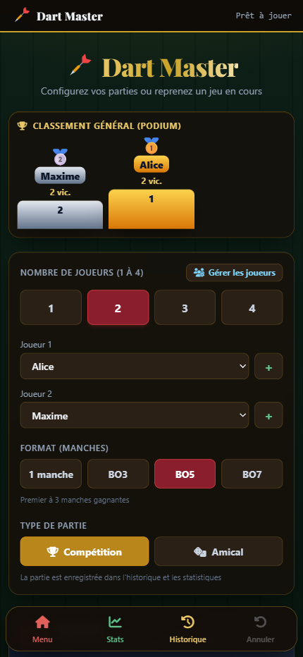
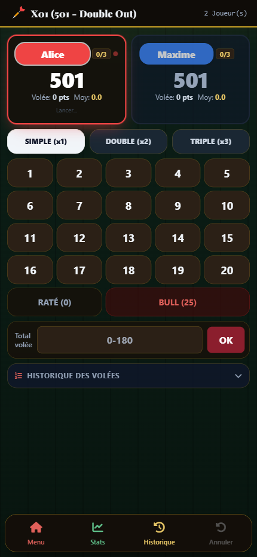
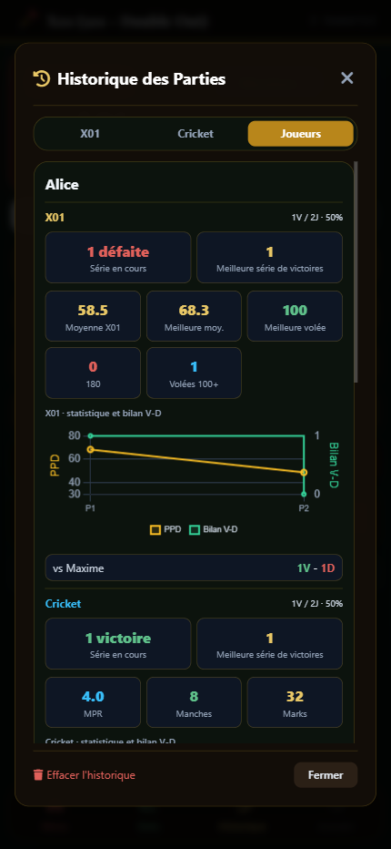

# Dart Master

Application web de comptage et de suivi de parties de fléchettes, conçue pour être utilisée sur téléphone comme sur ordinateur. L’interface est en français et s’adapte aux écrans mobiles. (100% vibe codée)

## Captures d’écran

Captures mobiles réalisées avec des données de démonstration.

Afficher les captures

### Accueil et configuration

### Partie X01

### Statistiques des joueurs

## Fonctionnalités

- **X01** : parties en 301, 501 ou 701, avec option de sortie en double.
- **Cricket** : modes Standard et Inversé, avec saisie rapide ou détail des fléchettes.
- **Joueurs et manches** : de 1 à 4 joueurs, gestion des joueurs, parties amicales ou compétitives, formats en une manche ou en BO3, BO5 et BO7.
- **Suivi de partie** : scores, tours et manches, multiplicateurs simple/double/triple, annulation de la dernière action et reprise d’une partie sauvegardée.
- **Historique** : résultats consultables par mode, avec analyse de partie et cible pour revoir les fléchettes.
- **Statistiques par joueur et par mode** : moyenne PPD et meilleures performances en X01; MPR et marks en Cricket; série actuelle et meilleure série de victoires calculées séparément pour chaque mode.
- **Graphiques d’évolution** : PPD en X01 et MPR en Cricket, chacun accompagné de son bilan victoires-défaites.
- **Sauvegarde** : export et import de l’historique au format JSON, avec synchronisation Google Drive de l’historique, de la partie en cours, des joueurs et des réglages.
- **Navigation mobile** : le bouton « précédent » ferme d’abord l’écran ouvert et permet de revenir au menu sans quitter la page.

## Utilisation

Aucune compilation ni installation de dépendances n’est nécessaire. Ouvrir `index.html` dans un navigateur récent. Pour y accéder depuis Android, la page peut être publiée sur un hébergement statique ou servie sur le réseau local.

Tailwind CSS, Chart.js, Font Awesome et la police Playfair Display sont chargés depuis des CDN; une connexion Internet est nécessaire pour leur chargement.

Les réglages, joueurs et parties sont d’abord stockés dans le `localStorage` du navigateur. Après connexion via **Google Drive**, les changements sont synchronisés automatiquement lorsque la connexion est active; le bouton permet aussi de lancer une synchronisation manuelle. L’export/import JSON reste disponible comme sauvegarde complémentaire.

La connexion Google nécessite Google Identity Services et Google Drive API activées dans Google Cloud, le scope `https://www.googleapis.com/auth/drive` ajouté aux données OAuth et une origine JavaScript autorisée dans le client OAuth. Ce scope donne à l’application un accès étendu au Drive de l’utilisateur connecté; il peut nécessiter une validation OAuth Google. Pour le développement local, ouvrir l’application via un serveur HTTP (par exemple `http://localhost:8000`) et autoriser exactement cette origine. Une page ouverte directement en `file://` ne peut pas utiliser OAuth.

Après connexion, l’application recherche `dart-master-shared.json` dans le Drive accessible au compte et le synchronise automatiquement. Si aucun fichier correspondant n’existe, elle en crée un dans ce Drive. Pour partager les données entre plusieurs comptes, le fichier doit être partagé avec chacun d’eux depuis Google Drive.